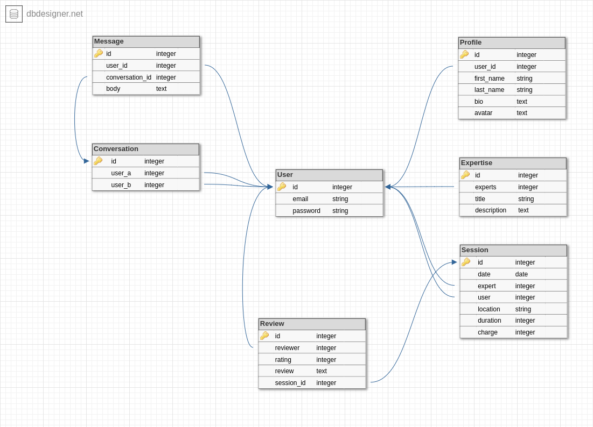

# Expertise

*slogan/description*

## Brief
*A full stack developer needs to be able to demonstrate they can build a complete application from design through to deployment, using appropriate tools and methodologies.*

You are to design, build, deploy and present a Ruby on Rails application. This app will cater to two markets that your app brings together (think Ebay with buyers & sellers, AirBnB with travellers & house owners, Uber with travellers & drivers).

## What is *'Expertise'*?

## Planning
<image of trello?>
https://trello.com/b/n4atPOiS/rails-project

## User Stories

## Data Structure


### Models

#### User
```
- email
- password
```

#### Profile
```
- user_id
- first_name
- last_name
- bio
- avatar_data
```

#### Expertise
```
- expert
- title
- description
```

#### Session
```
- date
- expert
- user *need better name*
- location
- duration
- charge
```

#### Conversation
```
- user_a
- user_b
```

#### Message
```
- user_id
- conversation_id
- body
```

#### Review
```
- session_id
- reviewer
- rating
- review
```

## Design

### Style Guide | Research
<image of style guide>

<link to pintrest?>

## Wireframes
<image of wireframes>

https://www.figma.com/file/eghlE7DgP40Nt59lSlbXGO/Major-Project?node-id=166%3A0

## Production

## Getting Started

## Technologies Used
The following technologies were used.

```
Ruby 2.4.1
Rails 5.1
Postgresql
Amazon S3 Cloud Storage
```

### Gems/APIs
```
gem ‘dotenv-rails’, groups: [:development, :test]
gem ‘aws-sdk’, ‘~> 3’
gem ‘devise’
gem ‘bootstrap’, ‘~> 4.0.0.beta’
gem ‘jquery-rails’
gem ‘fastimage’
gem ‘image_processing’
gem ‘mini_magick’
gem ‘shrine’
gem ‘geocoder’
gem ‘rspec-rails’, ‘~> 3.6’
```

### Installing
Creating the project?
- First install required gems:
- Setup postgresql
- create DB

Included Devise in the Gemfile
```
gem 'devise'
```
Then run
```
bundle install
```
Add the following code to the mailer section of /config/environments/development.rb
```
config.action_mailer.default_url_options = { host: 'localhost', port: 3000 }
```

Include Rspec in the Gemfile (in group :development, :test)
```
gem 'rspec-rails', '~> 3.6'
```

Run bundle install
```
bundle install
```

Initialise Rspec
```
rails generate rspec:install
```

Add dotenv to Gemfile. This must be at the top of the Gemfile
```
gem 'dotenv-rails', groups: [:development, :test]
```

## Deployment
Add additional notes about how to deploy this on a live system
- what commands/steps taken to deploy to heroku?


## Acknowledgments


