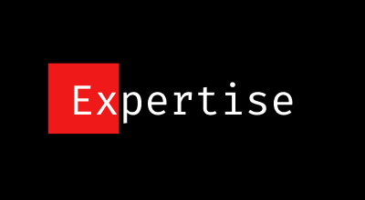
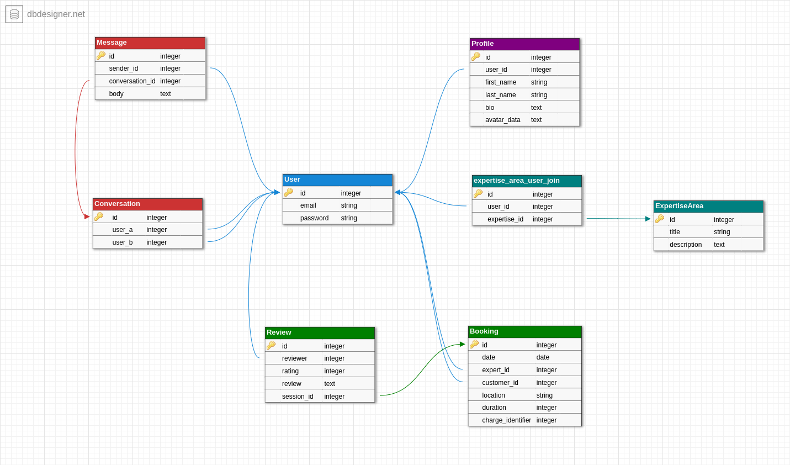

# Expertise


*slogan/description*

## Brief
*A full stack developer needs to be able to demonstrate they can build a complete application from design through to deployment, using appropriate tools and methodologies.*

You are to design, build, deploy and present a Ruby on Rails application. This app will cater to two markets that your app brings together (think Ebay with buyers & sellers, AirBnB with travellers & house owners, Uber with travellers & drivers).

## What is *'Expertise'*?
Expertise is an app that connects people to experts, allowing them to book sessions with them quickly and efficiently, bypassing the hassles of finding and organising consultations from consultation companies and allowing people to get expert's advice when urgent
### The problem

### The solution

## Planning
The planning stage began on paper. This was mainly brainstorming the idea, articulating what I as a user would benifit from a service such as 'Expertse'. The next logical step was user stories. The user stories, written from my own perspective/persona helped outline the minimum needed features and also, solidified the validity of the idea.

I sketched some rough designs of the UI and accompanying user journey on paper, allowing me to map out the needed pages and actions needed. This helped better understand what models and controllers that would be needed. I allocated some time to looking at similar and/or competing sites to get an idea of the layout, and what current users expect from an app in this field. I used figma to create higher fidelity designs, informed by the original paper sketches, helping me understand better the required UI components and a better idea of the available space and amount of content that should be displayed.

I transferred all my paper notes to trello, as to keep all my notes in one place. It gave me a much needed overview of all the aspects of the project I needed to complete and was able to prioritize accordingly.

I planned out the models and thier attributes in trello, and when I was confident had the structure inplace, I created an ERD in dbdesigner to visualise the database and the relationships between the tables. This helped greatly in visualising the data structure and allowed me to make sure I had no superfluous fields.

<image of trello?>
https://trello.com/b/n4atPOiS/rails-project

## User Stories
In order to: receive urgent feedback on my edit, as an amateur filmmaker I want to find someone with Expertise in video editing ,that can review my work and give valid feedback

In order to: Prepare myself for studying Web Development As a: future student I want to: Find an experienced Web Dev to inform me the tools I need and communities I should be a part of

In order to: Advise me on how to progress toward a career in cyber security As a: person not sure what path to take I want to: Speak with a Cyber Security expert and get advice based on *my* current situation

In order to: Better plan my business/start-up venture As a: entrepreneur I want to: Run my idea past someone who has succeeded in the same area I want to get into

In order to: Make sure the person I want to get consoltation from is indeed qualified As a: prospective user I want to: See the person's qualifications, and linkedin profile to assertain wheather they are indeed qualified.

In order to: Organise a meet up with an expert As a: person who wants advice I want to: Be able to message the person directly

In order to: Get an idea of how good/benificial this expert is. As a: person in need of their Expertise I want to: See what other users have said about their experiences

In order to: save time messageing potential experts about their availability As a: busy person with a strict schedule I want to: See an experts general availability on thier profile

In order to: Know if the expert is the kind of person I want to get advice from As a: potential user I want to: read a short bio on this person, to learn about thier accomplishments and get an idea about their personality

In order to: save time As a: budget conscious person I want to: see the experts price rate on their profile

In order to: organise a meeting with an expert in my area As a: user who needs a face to face meeting I want to: see what experts are in my area/city

In order to: organise a meeting with an expert not in my area As a: user who can't travel far I want to: be able to video chat with the expert.

In order to: Make some side income As a: an expert in a field with spare time I want to: offer my time to advise/consult people in need of my Expertise

In order to: Ensure I have flexibility with my time As a: an expert in a field with flexable spare time I want to: offer my time to advise as a "once-off" basis, or not be locked into consulting/advising on a regular basis.

In order to: prove to people that I have the talent to back up my claims As a: an experienced filmmaker I want to: be able to display my work on my profile for visitors to see

In order to: bring people into my profile As an: expert new to the site I want: people to see that my services are available on other social media networks **An example of this is: A person on youtube who produces content about X, might have a link in the description linking to thier profile "Want personalised advice from me about X? get in touch on....."

In order to: build up my profile As a: new expert to the site I want to: show how many successful sessions I've given

In order to: narrow down potential experts As a: Person in need of advice I want to: search and filter experts by their expertise

In order to: Start getting advice/guidance from an expert As a: potential user I want to: Be able to create an account

In order to: build by profile and reputation in the community  As a: New expert I want to: be able to contribute to the community, writing mini blog posts that are viewable by all users

In order to: Bring people to the site, As the creator of the site I want there to be: content that can access and be linked to externally. People who may not use the site may find the content interesting to read.

In order to:  Keep track of my sessions, As an: Active expert, I want to: see all my upcoming sessions of the week/month

In order to: Book and confirm my session, As a: user in need of advice, I want to: be able to make an online payment.

In order to: Confirm that I have initiated and payed for a session, As a user of the site I want to: Receive an email confirming the time/date and my payment info

In order to understand the context of a message, as a user, I want to see the previous messages in a conversation with another user

In order to better connect with my community, as a user, I want to be able to upload a photo of myself


## Data Structure


### Models

#### User
```
- email
- password
```

#### Profile
```
- user_id
- first_name
- last_name
- bio
- avatar_data
```

#### ExpertiseArea
```
- expert
- title
- description
```

#### Booking
```
- date
- expert_id
- client_id
- location
- duration
- charge_identifier
```

#### Conversation
```
- user_a
- user_b
```

#### Message
```
- user_id
- conversation_id
- body
```

#### Review
```
- session_id
- reviewer
- rating
- review
```

## Design

### Style Guide | Research
<image of style guide>

As mentioned above, I allocated some time to researching competing sites and thier layouts. Though tangentailly related, I was greatly informed by Linkedin's site. Its a very busy and unfriendly site to navigate, not to mention unflattering for the users. My goal in designing the interface was to make it elegant, comprising of only the bare minimum of components, and having navigation limited to as few pages as possible. Another goal in the design is more subjective, I wanted the site to look like something people wanted to join. Even though my desing skills a quite lacking, the philosophy is that being an expert in a field is something of importance, and great pride to the individual. Ideally, I would like the desing to cater to a feeling of prestige. To compare Linkedin's design, there are many components that are fighting for attention of the visitor's eye, my intention was to highlight the 'experts' accomplishments and areas of expertise first and foremost, with any supplimentary content emphasised less.

<link to pintrest?>

## Wireframes


My approach to designing the wireframes was to create wireframes with the components/features I believed I could ship in the alloted time, while designing it with a style I would like the finished product to look like if time wasn't an issue. The hybrid approach allowed me to better understand the user journey, omitting uneeded luxuries I wouldn't be able to deliver due to skill or time constraints, and also have the aethetic style inform the needed content and its placement on the page. I began with mobile design first, using a temporary monochromatic colour scheme to save time and also get a better idea of how to organise white space.

https://www.figma.com/file/eghlE7DgP40Nt59lSlbXGO/Major-Project?node-id=166%3A0

## Production

## Getting Started

Getting *Expertise* up and running.

## Technologies Used
The following technologies were used.

```
Ruby 2.4.1
Rails 5.1
Postgresql
Amazon S3 Cloud Storage
```

### Gems/APIs
```
gem 'devise'
gem 'pundit'
gem 'bootstrap', '~> 4.0.0.beta2.1'
gem 'jquery-rails'
gem 'mailgun-ruby', '~>1.1.6'

# Shrine & Dependencies
gem 'fastimage'
gem 'image_processing'
gem 'mini_magick'
gem 'shrine'

# AWS
gem 'aws-sdk', '~> 3'

# Stripe
gem 'stripe'

# Font Awesome
gem "font-awesome-rails"
```

### Installing
Creating the project?
- First install required gems:
- Setup postgresql
- create DB

Included Devise in the Gemfile
```
gem 'devise'
```
Then run
```
bundle install
```
Add the following code to the mailer section of /config/environments/development.rb
```
config.action_mailer.default_url_options = { host: 'localhost', port: 3000 }
```

Include Rspec in the Gemfile (in group :development, :test)
```
gem 'rspec-rails', '~> 3.6'
```

Run bundle install
```
bundle install
```

Initialise Rspec
```
rails generate rspec:install
```

Add dotenv to Gemfile. This must be at the top of the Gemfile
```
gem 'dotenv-rails', groups: [:development, :test]
```

Add shrine gem and it's depedencies
```
# Shrine Dependencies
gem 'fastimage'
gem 'image_processing'
gem 'mini_magick'
gem 'shrine'
```
Start Postgres server
```
# for Arch Linux
sudo systemctl start postgresql
```

Create Database
```
rails db:create
```

Create User (using devise)
```
rails g devise User
```

Add AWS-sdk gem to the Gemfile
```
gem 'aws-sdk', '~> 3'
```
```
bundle install
```

Then set up a new bucket and user.
Add credentials and bucket information to .env file

Include pundit in Gemfile
```
gem 'pundit'
```
Restart Rails server

*pundit installation info? generating? initializing? policies?*

Include mailgun gem in Gemfile
```
gem 'mailgun-ruby', '~>1.1.6'
```
Bundle install

Add the following to the development.rb in the mailer section:
```
  config.action_mailer.delivery_method = :mailgun
  config.action_mailer.mailgun_settings = {
    api_key: ENV.fetch('MAILGUN_API_KEY'),
    domain: ENV.fetch('MAILGUN_DOMAIN'),
  }
```
We need to add our mailgun credentials, and a support email address to our .env file
```
MAILGUN_API_KEY = apikey********************
MAILGUN_DOMAIN = domain*****************

SUPPORT_EMAIL = email@example.com
```

Stripe add gem
```
????
```

Add stripe credentials to .env
```

```

*Mention all the services the user has to signup for, including mailgun and adding 'authorized recipients'*
## Deployment
- Make sure you git repo is up to date
- In the root of the project run
```
heroku create
```
To confirm that the remote was added to the project run:
```
git config --list | grep heroku
```
Before deploying to Heroku, you need to add the environment variables from the .env file and add them directly to the heroku project.

Login to your Heroku dashboard and select your project


Click on the settings link at the top right


Then select 'Reveal Config Vars'


In the fields provided, add all the environment variables and their corrisponding keys


With those in place, you can now run the command to push the project to Heroku
```
git push heroku master
```

With the project successfully deployed, the next step is to migrate the database
```
heroku run rake db:migrate
```

To ensure that a dyno is running, execute
```
heroku ps:scale web=1
```
To check the state of the app's dyno, run
```
heroku ps
```
Finally, to visit the page, simply run
```
heroku open
```


## Challenges

## Future Features


## checklist
*Create your application using Ruby on Rails.*
*Demonstrate knowledge of Rails conventions.*
*Use postgresql database in development.*
Use an API (eg. Omniauth, Geocoding, Maps, other..).
*Use appropriate gems.*
*Use environmental variables to protect API keys etc. (dotenv)*
*Implement a payment system for your product. (e.g. Stripe)*
*Your app must send transactional emails (eg. using Mailgun).*
*Your app should have an internal user messaging system.*
*Your app will have some type of searching, sorting and/or filtering capability.*
*Your app will have some type of file uploading capability (eg. images).*
*Your app will have authentication (eg. Devise, must have full functionality in place).*
*Your app will have authorisation (users have restrictions on what they can see and edit).*
Your app will have an admin dashboard for the admin user to administrate the site.
*Document your application with a README that explains how to setup, configure and use your application.*

